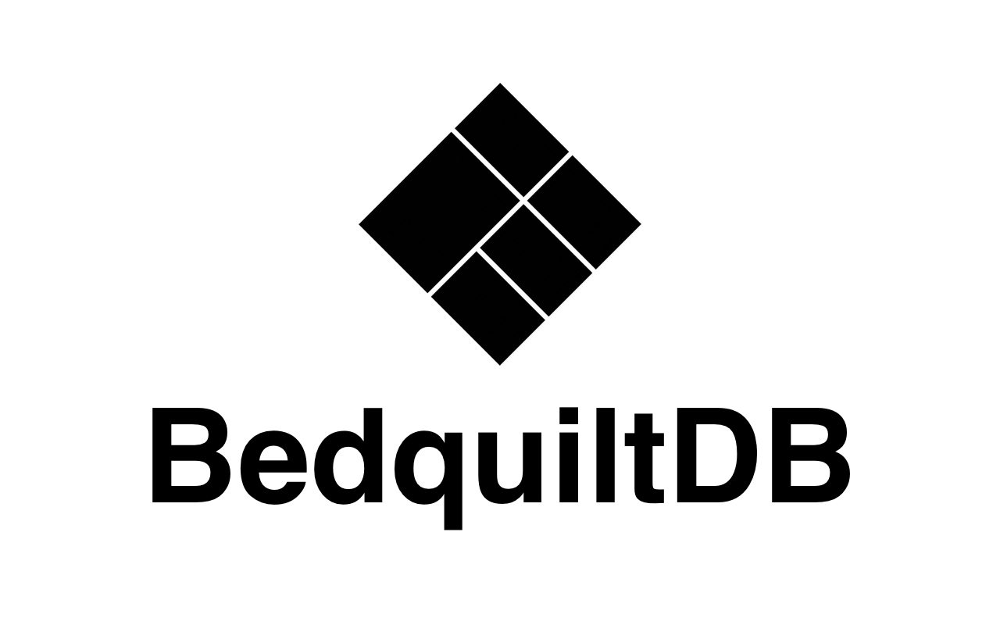

# Bedquilt

[](https://gitter.im/BedquiltDB/bedquilt-core?utm_source=badge&utm_medium=badge&utm_campaign=pr-badge&utm_content=badge)



[BedquiltDB](https://bedquiltdb.github.io) is a A JSON document-store built on PostgreSQL.

[](https://circleci.com/gh/BedquiltDB/bedquilt-core/tree/master)


# Releases

Release packages for BedquiltDB can be found on [pgxn](http://pgxn.org/dist/bedquilt/).


# Goals

- Borrow some of the good ideas and positive attributes of json
  object-stores and bring them to PostgreSQL
- Harness the new jsonb functionality of PostgreSQL and wrap it in a nice
programmatic API that is consistent across languages
- Make use of SQL strong-points, such as schema constraints and table joins
- Build a tool which is actually useful for developers


# Examples

This extension provides the core functionality of BedquiltDB, and can be used from ordinary SQL queries,
though it is recommended to use one of the driver libraries for you favourite programming language instead.

```PLpgSQL
-- Insert two documents into the 'people' collection.
select bq_insert(
    'people',
    '{"_id": "sarah@example.com",
      "name": "Sarah",
      "likes": ["icecream", "code"]}'
);
select bq_insert(
    'people',
    '{"name": "Mike",
      "likes": ["code", "rabbits"]}'
);


-- Find a single document,
-- where the "name" field is the string value "Mike".
select bq_find_one(
    'people',
    '{"name":  "Mike"}'
);


-- Find all documents in the 'people' collection
select bq_find('people', '{}');


-- Find all people who like icecream
select bq_find('people', '{"likes": ["icecream"]}');


-- Find a single document by its "_id" field.
-- This query hits the primary key index on the _id field
select bq_find_one_by_id('people', 'sarah@example.com');


-- Create an empty collection
select bq_create_collection('things');


-- Get a list of existing collections
select bq_list_collections();
```


# Documentation

Project documnetation hosted at [Read The Docs](http://bedquiltdb.readthedocs.org).

To build documentation, install the `mkdocs` utility and run:
```
$ make docs
```


# Drivers

BedquiltDB is intended to be used with client libraries (aka Drivers), such as:

- [pybedquilt](https://github.com/BedquiltDB/pybedquilt) for Python
- [node-bedquilt](https://github.com/BedquiltDB/node-bedquilt) for NodeJS
- [clj-bedquilt](https://github.com/BedquiltDB/clj-bedquilt) for Clojure

Installation instructions and documentation for each driver can be found on the
respective driver repositories.


# Prerequisites

- PostgreSQL >= 9.5
- PL/pgSQL
- PL/Pyton3u
- The pgcrypto extension


## Development prerequisites

- python >=2.7
- psycopg2 python library (`pip install pyscopg2`)
- a local installation of PostgreSQL, with pgxs
- mkdocs, for building documentation
- gnu make


# Installation

## From a pre-built package (recommended)

To install BedquiltDB on your PostgreSQL server, follow the instructions here:

http://bedquiltdb.readthedocs.org/en/latest/guide/installation/

## From source

If you would prefer to install from source, first clone this repositroy:

```
$ git clone https://github.com/BedquiltDB/bedquilt-core.git
$ cd bedquilt-core
```

Run the following to build the extension and install it to the local database:

```
$ sudo make install
```

Run this to build to a zip file:

```
$ make dist
```

Then, on the postgres server:

```PLpgSQL
CREATE EXTENSION IF NOT EXISTS pgcrypto;
CREATE EXTENSION IF NOT EXISTS plpython3u;
CREATE EXTENSION bedquilt;
```

Test out the bedquilt extension by running a simple `find` operation:

```PlpgSQL
select bq_find('stuff', '{}');
```


# Tests

Run `make test` to run the test suite. Requires a `bedquilt_test` database
that the current user owns.


# Contributing

Contributions are welcome, to any of the BedquiltDB projects. Just open an issue,
or get in touch directly.


# License

Bedquilt is released under the [MIT License](./LICENSE.txt).
